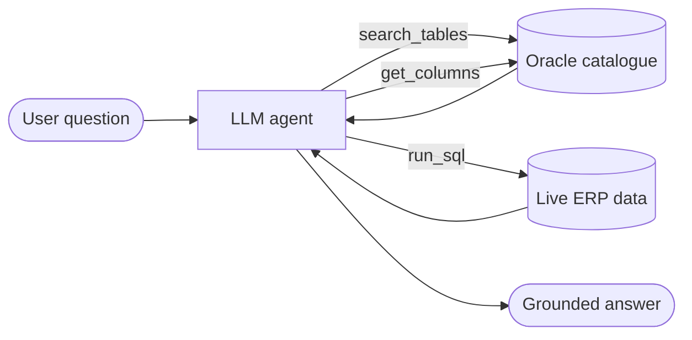

<!-- ============================ HEADER ============================ -->
<p align="center">
  
</p>

<p align="center">
  <a href="https://github.com/Hasebul47">
    
  </a>
</p>

<p align="center">
  <a href="https://linkedin.com/in/hasebulislam"></a>
  <a href="mailto:hasebulislam47@gmail.com"></a>
  <a href="https://doi.org/10.1109/STI64222.2024.10951130"></a>
  
</p>

---

## 👋 About Me

```python
class HasebulIslam:
    role        = "AI Engineer / AI Developer"
    company     = "Ha-Meem Group"            # one of Bangladesh's largest garment manufacturers
    location    = "Dhaka, Bangladesh 🇧🇩"
    education   = "B.Sc. in Computer Science & Engineering — Green University of Bangladesh"

    focus = [
        "LLM-powered document extraction (PDFs, scans, IDs)",
        "OCR & computer vision with vision-language models",
        "Agentic RAG and Text-to-SQL over live ERP data",
        "Multi-model LLM routing with automatic failover",
        "Production deployment: FastAPI · Docker · CI/CD",
    ]

    shipped    = "16+ AI & automation systems running in production"
    published  = "2 IEEE papers on ensemble machine learning"

    def say_hi(self):
        return "Let's build AI that actually ships. 🚀"
```

---

## 🧠 What I Build

<table>
  <tr>
    <td width="50%" valign="top">
      <h3>📄 Intelligent Document Processing</h3>
      LLM extraction pipelines that turn Purchase Orders, CVs and National IDs — from PDFs and scanned images — into validated Oracle ERP records, with OCR and vision-model fallback for image-only files.
    </td>
    <td width="50%" valign="top">
      <h3>💬 AI Chatbot (Agentic RAG)</h3>
      A RAG chatbot that answers natural-language business questions on live ERP data, using agentic schema retrieval and Text-to-SQL.
    </td>
  </tr>
  <tr>
    <td width="50%" valign="top">
      <h3>🔀 Multi-Model Architecture</h3>
      A provider-independent LLM layer with automatic failover across cloud and on-premise models (OpenAI, Gemini, OpenRouter, Ollama), cutting inference cost and vendor lock-in.
    </td>
    <td width="50%" valign="top">
      <h3>👁️ Multimodal AI</h3>
      Integrated computer vision, NLP and RAG for multimodal, knowledge-driven AI systems.
    </td>
  </tr>
  <tr>
    <td width="50%" valign="top">
      <h3>🕸️ Web Scraping & Alerting</h3>
      Concurrent multi-source scrapers with a background worker that pushes real-time alerts over WhatsApp, Telegram and email.
    </td>
    <td width="50%" valign="top">
      <h3>🚢 Deployment</h3>
      Every system shipped as containerised FastAPI + Streamlit services with automated CI/CD to Linux hosts.
    </td>
  </tr>
</table>

---

## 🚀 Featured Projects

> Click a project to expand it.

<details>
<summary><b>📦 PO Extraction & ERP Sync Platform</b> &nbsp;<code>Production</code></summary>
<br/>

- Extraction engine with buyer-specific parsers for **40+ international buyers**, converting heterogeneous PO PDFs into normalised Excel and Oracle records.
- Integrated offline **Japanese→English** and **Russian→English** neural machine translation to process foreign-language orders without external API calls.
- Constraint validation on upload and continuous deployment via GitHub Actions.


</details>

<details>
<summary><b>🪪 Intelligent Document Processing Microservice (CV / NID / PO)</b> &nbsp;<code>Production</code></summary>
<br/>

- Stateless microservice extracting structured data from resume and identity documents.
- Pages are rasterised and sent to a **vision-language model** when no text layer exists; output is constrained by **Pydantic** schemas before being written to Oracle HR tables.
- Pluggable provider (Gemini ⇄ OpenAI) behind a single engine interface.


</details>

<details>
<summary><b>🤖 ERP AI Chatbot — Agentic RAG</b> &nbsp;<code>Production</code></summary>
<br/>



- Searches the Oracle catalogue for relevant tables, fetches column schemas, then generates and executes SQL over bounded multi-round tool calls.
- Injects only relevant schema to stay within token limits, with enforced join paths and soft-delete filters.
- OpenAI-compatible tool definitions — runs on cloud models or locally on **Ollama**, keeping ERP data on-premise.


</details>

<details>
<summary><b>📬 MailPilot AI — Executive Email Briefing Agent</b> &nbsp;<code>Production</code></summary>
<br/>

- Connects to the corporate mail server over IMAP and generates executive summaries, action items and draft replies.
- Multi-provider LLM layer fails over automatically across OpenRouter, OpenAI and Gemini, with a **15-worker parallel scheduler** for high-volume mailboxes.


</details>

<details>
<summary><b>📦 Pre-Pack & Carton EDI Automation</b> &nbsp;<code>Production</code></summary>
<br/>

- Multi-tier parser converting EDI packing plans, carton stickers and UPC tickets into standard CARTON and UPC reports across six packaging classifications.


</details>

<details>
<summary><b>🧑‍💼 AI Recruitment Automation Platform (BDJobs)</b> &nbsp;<code>R&D</code></summary>
<br/>

- Posts jobs from an Excel spec, auto-downloads applicant CVs and ranks candidates using a multi-model LLM ensemble.


</details>

---

## 🛠️ Tech Stack

<p align="center">
  
</p>

<p align="center">
  
  
  
  
  
  
  
  
  
  
</p>

<details>
<summary><b>🔍 Full skill breakdown</b></summary>
<br/>

| Area | Skills |
|---|---|
| **Generative AI** | LLMs, RAG, Agentic AI, prompt engineering, structured output, tool calling, multi-model routing |
| **Computer Vision & OCR** | Vision-language models, OCR, PDF rasterisation, OpenCV, PyMuPDF, pdfplumber |
| **Machine Learning** | Classification, regression, ensemble & stacking models, XGBoost, cross-validation, model evaluation, EDA |
| **Deep Learning** | PyTorch, TensorFlow, Keras, transfer learning, fine-tuning |
| **Backend & Data** | FastAPI, Streamlit, REST APIs, Oracle, PostgreSQL, SQLite, Pydantic |
| **Automation** | Web scraping (BeautifulSoup, Requests), Playwright, RPA, scheduled pipelines |
| **DevOps** | Docker, Docker Compose, Podman, Nginx, GitHub Actions CI/CD, Linux |
| **Infrastructure** | Active Directory (ADDS), Group Policy, VLAN routing, server administration |

</details>

---

## 📚 Publications

| | Paper | Venue |
|---|---|---|
| 📄 | **ThyroStack: A Stacking Model for Thyroid Disease Prediction** | IEEE STI 2024 · [DOI: 10.1109/STI64222.2024.10951130](https://doi.org/10.1109/STI64222.2024.10951130) |
| 📄 | **A Stacking Ensemble Model for Thyroid Disease Prediction** | IEEE CS BDC Symposium 2024 |

---

## 📊 GitHub Stats

<p align="center">
  
  
</p>

<p align="center">
  
</p>

<p align="center">
  
</p>

<!-- Snake animation: generated daily by .github/workflows/snake.yml -->
<p align="center">
  <picture>
    <source media="(prefers-color-scheme: dark)" srcset="https://raw.githubusercontent.com/Hasebul47/Hasebul47/output/github-snake-dark.svg" />
    <source media="(prefers-color-scheme: light)" srcset="https://raw.githubusercontent.com/Hasebul47/Hasebul47/output/github-snake.svg" />
    
  </picture>
</p>

---

## 🤝 Let's Connect

<p align="center">
  I'm open to <b>AI Engineer</b> roles and collaboration on applied AI, document intelligence and LLM systems.<br/>
  <a href="https://linkedin.com/in/hasebulislam">LinkedIn</a> ·
  <a href="mailto:hasebulislam47@gmail.com">Email</a> ·
  <a href="https://github.com/Hasebul47">GitHub</a>
</p>

<p align="center">
  
</p>
